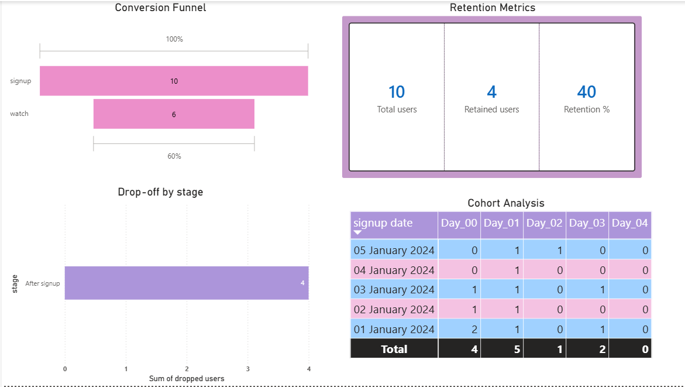

# 📊 Product Analytics Project

## 🎯 Objective

Analyze user behavior and identify drop-offs, retention patterns, and engagement trends to improve product performance.

## 🛠 Tools Used

* SQL (MySQL/PostgreSQL)
* Python (optional)
* Power BI (for dashboard)

## 📊 Key Analysis Performed

### 1. Funnel Analysis

Tracked user journey:
Visit → Signup → Watch → Subscribe

### 2. Drop-off Analysis

Identified where users leave the funnel using LEFT JOIN logic.

### 3. Retention Analysis

Calculated Day 1 retention to measure user return behavior.

### 4. Cohort Analysis

Grouped users by signup date and tracked engagement over time.

## 💡 Key Insights

* Significant drop-off after signup stage
* Majority of users engage only on Day 0
* Certain cohorts show better retention (e.g., Jan 3)

## 📈 Business Recommendations

* Improve onboarding experience
* Enhance content recommendations
* Optimize acquisition channels

## 📁 Project Structure

* /sql → All SQL queries
* /dataset → Input data
* /dashboard → Power BI file

## 🚀 Outcome

Developed a complete product analytics pipeline from raw data to actionable insights.

## 📊 Dashboard Preview

